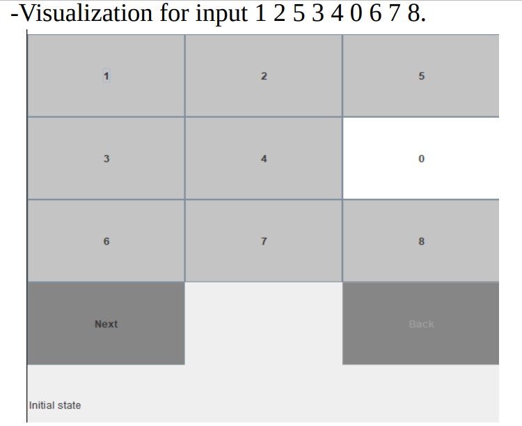
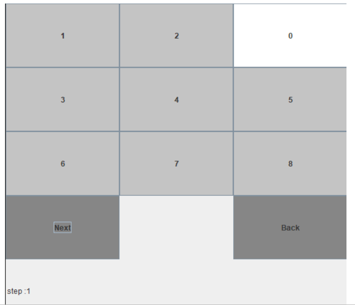
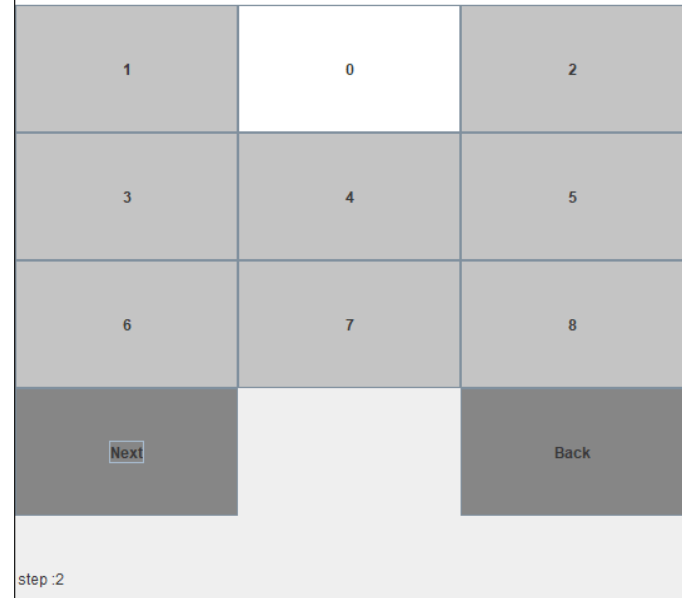
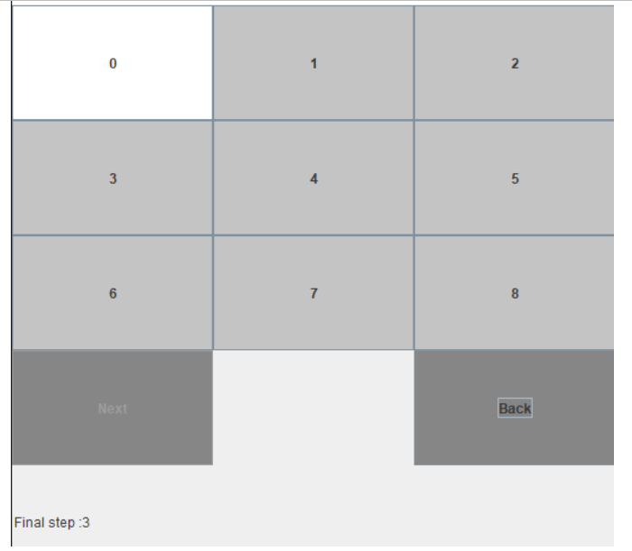

# 8_puzzle_solver.
8 puzzle solver using BFS, DFS and A* , It has simulation that shows the path from start till reaching the goal.
##Heursitics for A* by :
1-Manhattan distance
2-Euclid distance

